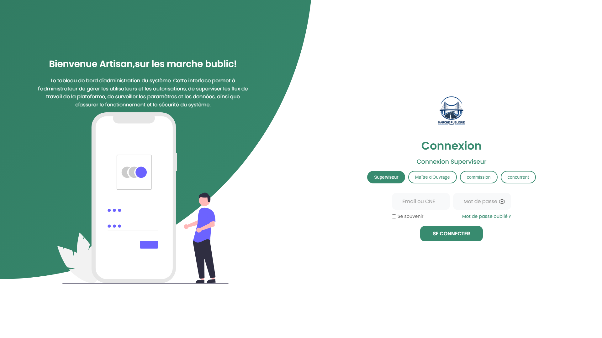

# Gestion des Marchés Publics

Application web de gestion des marchés publics.

## 🔐 Authentification

Système de connexion et de création de comptes pour :
- Superviseur
- Maître d’Ouvrage
- Commission Concurrente

## 📊 Tableau de bord

Tableau de bord dédié au Maître d’Ouvrage.

## 📸 Aperçu du projet

## 📸 Phase 1 — Aperçu du projet

  
  
  

  
  
  

